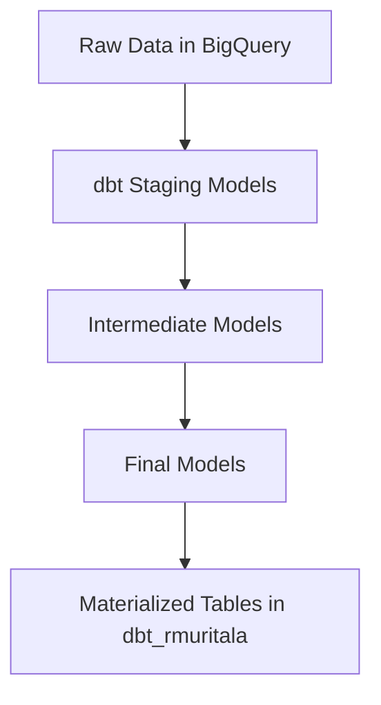

# DBT Basics — End-to-End dbt + BigQuery Project

This project showcases an end-to-end analytics engineering workflow using dbt connected to Google BigQuery.  
It includes data modeling, transformation, testing, documentation, and deployment of analytics-ready tables into the dataset `dbt_rmuritala`.

---

# Table of Contents

1. [Project Overview](#project-overview)
2. [Architecture](#architecture)
3. [Project Structure](#project-structure)
4. [Key Components](#key-components)
5. [What Was Implemented](#what-was-implemented)
6. [How to Run This Project](#how-to-run-this-project)
7. [Lightweight Case Study](#lightweight-case-study)
8. [Resources](#resources)

---

# Project Overview

## Objective

To build a structured, production-ready dbt project demonstrating:

- Data transformation using SQL  
- Model organization (staging, intermediate, final)  
- Automated testing  
- Use of macros and snapshots  
- Deployment of transformed data into BigQuery  

## Tools Used

- dbt Cloud  
- Google BigQuery  
- GCP Service Account  
- GitHub for version control  

## Target Dataset

```
lofty-defender-389421.dbt_rmuritala
```

---

# Architecture

## Mermaid Diagram



---

# Project Structure

```
dbt-basics/
│
├── analyses/
├── macros/
├── models/
├── seeds/
├── snapshots/
├── tests/
├── dbt_project.yml
└── README.md
```

---

# Key Components

## models/
Contains staging, intermediate, and final models used for cleaning, transforming, and preparing raw data.

## tests/
Schema tests such as:
- unique  
- not-null  
- accepted values  

## macros/
Reusable SQL and Jinja functions that reduce repetitive code.

## snapshots/
Tracks slowly-changing historical data over time.

---

# What Was Implemented

## 1. BigQuery Connection
- Authentication via a GCP service account JSON key  
- dbt Cloud connected successfully to BigQuery  
- All outputs materialize into the dataset `dbt_rmuritala`

## 2. Data Modeling
- Staging models: clean and standardize raw fields  
- Intermediate models: business logic and joins  
- Final models: analytics-ready tables  

## 3. Testing
Implemented schema-level tests ensuring:
- Data reliability  
- Constraint validation  
- Consistency across model outputs  

## 4. Snapshots and Macros
- Snapshots created to track historical changes  
- Macros written for modular and maintainable SQL  

---

# How to Run This Project

## Run All Models

```bash
dbt run
```

## Run All Tests

```bash
dbt test
```

## Generate Documentation

```bash
dbt docs generate
dbt docs serve
```

---

# Lightweight Case Study

## Business Problem
Raw datasets contained inconsistent naming, mixed data types, missing values, and unclear structure.  
There was no standardized pipeline for cleaning or preparing them for downstream analytics.

## Solution
This project created an end-to-end transformation workflow using dbt:

1. Staging models to clean and standardize source data  
2. Intermediate models applying business rules and joins  
3. Final models structured for analytics and reporting  
4. Tests ensuring ongoing data quality  
5. Snapshots preserving historical record changes  

## Outcome
A modular, testable, reliable dbt pipeline producing analytics-ready tables in BigQuery.  
This demonstrates core analytics engineering skills including modeling, testing, documentation, and cloud warehouse integration.

---

# Resources

- dbt Documentation: https://docs.getdbt.com/docs/introduction  
- dbt Discourse: https://discourse.getdbt.com  
- dbt Community: https://getdbt.com/community  
- BigQuery Docs: https://cloud.google.com/bigquery/docs  

